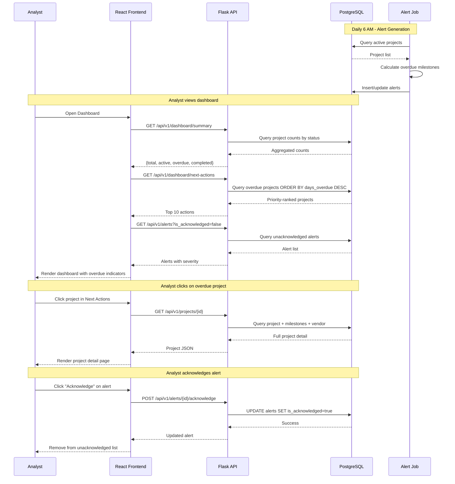

# plan.md — The HOW
## Reliability Project Workflow Tracker

**Version:** 1.0
**Last Updated:** November 30, 2024
**Source:** [spec.md](./spec.md)

---

## 1. Technology Stack

| Layer | Technology | Version | Rationale |
|-------|------------|---------|-----------|
| **Frontend** | React | 18.x | Modern SPA framework, large ecosystem |
| **UI Library** | Material-UI (MUI) | 5.x | Enterprise components, Southern Company theming |
| **Charts** | Recharts | 2.x | React-native charting, declarative API |
| **Gantt Chart** | gantt-task-react | 0.3.x | Lightweight, customizable Gantt component |
| **State Management** | React Query + Zustand | Latest | Server state + UI state separation |
| **Backend** | Flask (Python) | 3.x | Lightweight, Databricks-native Python |
| **Data Access** | Databricks SQL Connector | 3.x | Native Python connector for Unity Catalog |
| **Database** | Delta Lake + Unity Catalog | Latest | Serverless SQL warehouse, ACID transactions |
| **Deployment** | Databricks Asset Bundles | Latest | IaC for Databricks resources |
| **Hosting** | Databricks Apps | Latest | Managed app hosting |
| **Jobs** | Databricks Jobs | Latest | Scheduled batch processing |

---

## 2. Architecture Overview

```
┌─────────────────────────────────────────────────────────────────┐
│                        DATABRICKS APPS                          │
├─────────────────────────────────────────────────────────────────┤
│  ┌─────────────────────┐     ┌─────────────────────────────┐   │
│  │   React Frontend    │────▶│      Flask Backend          │   │
│  │   (Material-UI)     │     │      (REST API)             │   │
│  └─────────────────────┘     └──────────────┬──────────────┘   │
│                                             │                   │
├─────────────────────────────────────────────┼───────────────────┤
│                    UNITY CATALOG            │                   │
│  ┌──────────────────────────────────────────▼──────────────┐   │
│  │              Delta Lake Tables (SQL Warehouse)           │   │
│  └─────────────────────────────────────────────────────────┘   │
├─────────────────────────────────────────────────────────────────┤
│                    DATABRICKS JOBS                              │
│  ┌─────────────────┐  ┌─────────────────┐  ┌────────────────┐  │
│  │  Data Sync      │  │  Alert Gen      │  │  Metrics Calc  │  │
│  │  (Hourly)       │  │  (Daily 6AM)    │  │  (Daily 5AM)   │  │
│  └─────────────────┘  └─────────────────┘  └────────────────┘  │
└─────────────────────────────────────────────────────────────────┘
```

---

## 3. Data Model

### 3.1 Entity Relationship Diagram

```
┌─────────────┐       ┌─────────────┐       ┌─────────────┐
│   vendors   │       │  projects   │       │ milestones  │
├─────────────┤       ├─────────────┤       ├─────────────┤
│ id (PK)     │◄──────│ vendor_id   │       │ id (PK)     │
│ name        │       │ id (PK)     │◄──────│ project_id  │
│ code        │       │ work_order  │       │ stage       │
│ is_active   │       │ status      │       │ expected_dt │
└─────────────┘       │ priority    │       │ actual_dt   │
                      │ version     │       │ is_overdue  │
                      └─────────────┘       └─────────────┘
                             │
                             ▼
┌─────────────┐       ┌─────────────┐       ┌─────────────┐
│   alerts    │       │ audit_logs  │       │vendor_metrics│
├─────────────┤       ├─────────────┤       ├─────────────┤
│ id (PK)     │       │ id (PK)     │       │ id (PK)     │
│ project_id  │       │ project_id  │       │ vendor_id   │
│ alert_type  │       │ user_id*    │       │ period_start│
│ severity    │       │ action      │       │ on_time_rate│
│ is_ack      │       │ old_value   │       │ avg_days    │
└─────────────┘       │ new_value   │       │ revision_rt │
                      └─────────────┘       └─────────────┘

* user_id from Databricks Apps identity context
```

### 3.2 Key Entities

#### vendors
| Field | Type | Description |
|-------|------|-------------|
| id | UUID | Primary key |
| name | VARCHAR(255) | Vendor company name |
| code | VARCHAR(50) | Short identifier (e.g., "ABC") |
| contact_name | VARCHAR(255) | Primary contact |
| contact_email | VARCHAR(255) | Contact email |
| is_active | BOOLEAN | Active/inactive flag |

#### projects
| Field | Type | Description |
|-------|------|-------------|
| id | UUID | Primary key |
| work_order_number | VARCHAR(50) | Unique work order ID |
| vendor_id | UUID | Foreign key to vendors |
| description | TEXT | Project description |
| region | VARCHAR(100) | Geographic region |
| status | VARCHAR(50) | Current status (enum: authorized, assigned_to_vendor, design_submitted, qa_qc, approved, construction_ready) |
| priority | VARCHAR(20) | low/normal/high/critical |
| authorized_date | DATE | Authorization date |
| sent_to_vendor_date | DATE | Sent to vendor |
| received_from_vendor_date | DATE | Design received |
| target_completion_date | DATE | Target completion |
| actual_completion_date | DATE | Actual completion |
| revision_count | INTEGER | Number of revisions |
| version | INTEGER | Optimistic lock version (default 1) |
| updated_at | TIMESTAMP | Last modification timestamp |

#### milestones
| Field | Type | Description |
|-------|------|-------------|
| id | UUID | Primary key |
| project_id | UUID | Foreign key to projects |
| stage | VARCHAR(50) | Milestone stage name |
| expected_date | DATE | Expected date |
| actual_date | DATE | Actual date |
| sla_days | INTEGER | SLA threshold |
| is_overdue | BOOLEAN | Overdue flag |
| days_overdue | INTEGER | Days past SLA |

#### alerts
| Field | Type | Description |
|-------|------|-------------|
| id | UUID | Primary key |
| project_id | UUID | Foreign key to projects |
| alert_type | VARCHAR(50) | Type (milestone_overdue, etc.) |
| message | TEXT | Alert message |
| severity | VARCHAR(20) | info/warning/critical |
| is_acknowledged | BOOLEAN | Acknowledged flag |
| created_at | TIMESTAMP | Creation time |

#### audit_logs
| Field | Type | Description |
|-------|------|-------------|
| id | UUID | Primary key |
| project_id | UUID | Foreign key to projects |
| user_id | VARCHAR(255) | User who made change |
| action | VARCHAR(50) | create/update/delete |
| field_changed | VARCHAR(100) | Modified field |
| old_value | TEXT | Previous value |
| new_value | TEXT | New value |
| created_at | TIMESTAMP | Timestamp |

#### vendor_metrics
| Field | Type | Description |
|-------|------|-------------|
| id | UUID | Primary key |
| vendor_id | UUID | Foreign key to vendors |
| period_start | DATE | Metrics period start |
| period_end | DATE | Metrics period end |
| on_time_rate | DECIMAL(5,2) | On-time % |
| avg_turnaround_days | DECIMAL(5,1) | Avg days |
| revision_rate | DECIMAL(5,2) | Revision % |
| total_projects | INTEGER | Total in period |

#### Authentication (Databricks Apps)

> **POC Note:** Authentication handled by Databricks Apps built-in identity. User identity and roles obtained from Databricks workspace context. No custom users table required for POC.

---

## 4. Project Structure

```
gpc-reliability-tracker/
├── app/                          # Flask backend
│   ├── __init__.py               # App factory
│   ├── config.py                 # Configuration
│   ├── models/                   # SQLAlchemy models
│   │   ├── project.py
│   │   ├── vendor.py
│   │   ├── milestone.py
│   │   ├── alert.py
│   │   └── audit.py
│   ├── routes/                   # API blueprints
│   │   ├── projects.py
│   │   ├── vendors.py
│   │   ├── dashboard.py
│   │   ├── alerts.py
│   │   └── gantt.py
│   ├── services/                 # Business logic
│   │   ├── project_service.py
│   │   ├── alert_service.py
│   │   ├── metrics_service.py
│   │   └── sync_service.py
│   └── utils/
│       └── helpers.py
├── frontend/                     # React frontend
│   ├── src/
│   │   ├── components/
│   │   │   ├── common/           # Shared components
│   │   │   ├── charts/           # Recharts wrappers
│   │   │   └── layout/           # App shell
│   │   ├── pages/
│   │   │   ├── Dashboard.tsx
│   │   │   ├── Projects.tsx
│   │   │   ├── ProjectDetail.tsx
│   │   │   ├── GanttView.tsx
│   │   │   ├── Vendors.tsx
│   │   │   └── VendorDetail.tsx
│   │   ├── hooks/                # Custom hooks
│   │   ├── services/             # API client
│   │   ├── store/                # Zustand stores
│   │   ├── theme/                # MUI theme
│   │   └── types/                # TypeScript types
│   └── package.json
├── jobs/                         # Databricks Jobs
│   ├── data_sync.py
│   ├── alert_generator.py
│   └── metrics_calculator.py
├── tests/
│   ├── backend/
│   └── frontend/
├── databricks.yml                # DABs config
├── requirements.txt
└── README.md
```

---

## 5. API Design

### 5.1 Core Endpoints

| Method | Endpoint | Description |
|--------|----------|-------------|
| GET | `/api/v1/projects` | List projects (paginated, filterable) |
| GET | `/api/v1/projects/{id}` | Get project detail |
| PATCH | `/api/v1/projects/{id}` | Update project |
| GET | `/api/v1/projects/{id}/history` | Get audit history |
| GET | `/api/v1/vendors` | List vendors |
| GET | `/api/v1/vendors/{id}` | Get vendor detail |
| GET | `/api/v1/vendors/{id}/metrics` | Get vendor metrics |
| GET | `/api/v1/dashboard/summary` | Dashboard summary cards |
| GET | `/api/v1/dashboard/next-actions` | Priority action list |
| GET | `/api/v1/alerts` | List alerts |
| POST | `/api/v1/alerts/{id}/acknowledge` | Acknowledge alert |
| GET | `/api/v1/gantt` | Gantt chart data |
| GET | `/api/v1/projects/export` | CSV export |

---

## 6. Sequence Diagram: Primary User Story (US-1)

The following diagram illustrates the flow when a reliability analyst views overdue projects:



---

## 7. SLA Configuration

SLA thresholds align with spec clarification (Session 2025-11-30).

| Stage Transition | SLA (Days) | Warning Threshold | Critical Threshold |
|------------------|------------|-------------------|-------------------|
| Authorized → Assigned to Vendor | N/A | - | - |
| Assigned to Vendor → Design Submitted | 7 | 7 days | 14 days |
| Design Submitted → QA/QC | N/A | - | - |
| QA/QC → Approved | 7 | 7 days | 14 days |
| Approved → Construction Ready | 3 | 3 days | 7 days |

**Alert Severity Logic:**
- **Green (On Track):** Within SLA
- **Yellow (Warning):** Exceeds SLA but < 2× SLA
- **Red (Critical):** Exceeds 2× SLA or 7+ days overdue

---

## 8. Deployment Configuration

### 8.1 Databricks Asset Bundles (databricks.yml)

```yaml
bundle:
  name: gpc-reliability-tracker

workspace:
  host: ${DATABRICKS_HOST}

variables:
  environment:
    default: dev

resources:
  apps:
    reliability-tracker:
      source_code_path: .
      config:
        command: ["gunicorn", "app:create_app()", "--bind", "0.0.0.0:8000"]
        env:
          - name: DATABASE_URL
            value: ${DB_CONNECTION_STRING}
          - name: FLASK_ENV
            value: ${var.environment}

  jobs:
    data-sync:
      name: "Reliability Data Sync"
      schedule:
        quartz_cron_expression: "0 0 * * * ?"
      tasks:
        - task_key: sync
          python_wheel_task:
            package_name: gpc_reliability
            entry_point: data_sync

    alert-generator:
      name: "Reliability Alert Generator"
      schedule:
        quartz_cron_expression: "0 0 6 * * ?"
      tasks:
        - task_key: generate_alerts
          python_wheel_task:
            package_name: gpc_reliability
            entry_point: alert_generator

    metrics-calculator:
      name: "Vendor Metrics Calculator"
      schedule:
        quartz_cron_expression: "0 0 5 * * ?"
      tasks:
        - task_key: calculate_metrics
          python_wheel_task:
            package_name: gpc_reliability
            entry_point: metrics_calculator
```

### 8.2 Environments

| Environment | Purpose | Deployment Trigger |
|-------------|---------|-------------------|
| dev | Development | Push to `develop` branch |
| staging | QA/UAT | Push to `staging` branch |
| prod | Production | Tag with `v*` pattern |

---

## 9. Testing Strategy

| Type | Tool | Coverage Target |
|------|------|-----------------|
| Unit (Backend) | pytest | 80% |
| Unit (Frontend) | Jest + RTL | 70% |
| Integration | pytest + httpx | Critical paths |
| E2E | Playwright | 5 core journeys |
| Performance | Locust | 50 concurrent users |

---

## 10. Open Technical Decisions

| # | Decision | Options | Status |
|---|----------|---------|--------|
| 1 | Authentication | Basic Auth vs SSO | Basic Auth for MVP |
| 2 | Jets DB connector | JDBC vs native | TBD - need credentials |
| 3 | Frontend routing | React Router v6 | Confirmed |
| 4 | State management | Redux vs Zustand | Zustand (simpler) |
| 5 | Backup strategy | Databricks native vs custom | Databricks native |
